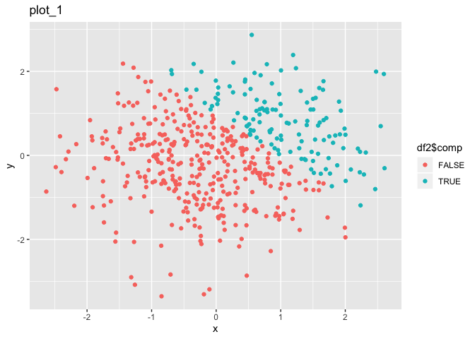

p8105\_hw1\_xs2384
================

Problem 1
---------

``` r
library(tidyverse)
```

    ## ── Attaching packages ──────────────────────────────────────────────────────────────────────────────────────────────── tidyverse 1.2.1 ──

    ## ✔ ggplot2 3.2.1     ✔ purrr   0.3.2
    ## ✔ tibble  2.1.3     ✔ dplyr   0.8.3
    ## ✔ tidyr   0.8.3     ✔ stringr 1.4.0
    ## ✔ readr   1.3.1     ✔ forcats 0.4.0

    ## ── Conflicts ─────────────────────────────────────────────────────────────────────────────────────────────────── tidyverse_conflicts() ──
    ## ✖ dplyr::filter() masks stats::filter()
    ## ✖ dplyr::lag()    masks stats::lag()

``` r
df <- tibble(
  norm_sp = rnorm(8),
  logi_vec = norm_sp > 0 ,
  chr_vec = c("1", "2", "3", "4", "5", "6", "7", "8"),
  fac_vec = factor(c("0","1","0","2","1","2","0","1"))
)

mean(pull(df, norm_sp))
```

    ## [1] 0.01169572

``` r
mean(pull(df, logi_vec))
```

    ## [1] 0.375

``` r
mean(pull(df, chr_vec))
```

    ## Warning in mean.default(pull(df, chr_vec)): argument is not numeric or
    ## logical: returning NA

    ## [1] NA

``` r
mean(pull(df, fac_vec))
```

    ## Warning in mean.default(pull(df, fac_vec)): argument is not numeric or
    ## logical: returning NA

    ## [1] NA

The mean of random sample and logical vector works with function mean, but the character vector and factor vector doen't work.

``` r
as.numeric(df$logi_vec)
as.numeric(df$chr_vec)
as.numeric(df$fac_vec)
```

All of three functions run the result successfully. For the logical vector, the 'True' and 'False' were transferred to 1 and 0. The character was successfully changed to its original input, since the data itself is numeric but its type was character. For the factor vector, I typed the numbers as the factor level and it could be transferred to numeric finally.

This does explain why the mean function was failed on these variables. The mean function can only calculate the data type of numeric and logical, although the factor vector and character vector I typed are numbers.

``` r
as.numeric(df$logi_vec) * df$norm_sp
```

    ## [1] 0.000000 1.080189 1.392302 1.178871 0.000000 0.000000 0.000000 0.000000

``` r
as.factor(df$logi_vec) * df$norm_sp
```

    ## Warning in Ops.factor(as.factor(df$logi_vec), df$norm_sp): '*' not
    ## meaningful for factors

    ## [1] NA NA NA NA NA NA NA NA

``` r
as.numeric(as.factor(df$logi_vec)) * df$norm_sp
```

    ## [1] -0.50682583  2.16037869  2.78460361  2.35774153 -1.16206892 -1.45480003
    ## [7] -0.03288041 -0.40122095

Problem 2
---------

``` r
df2 <- tibble(
  x = rnorm(500),
  y = rnorm(500),
  comp = x + y >1,
  coer_lton = as.numeric(comp),
  coer_ltof = as.factor(comp)
)
```

The size of datasets is 500 rows, and 5 colunms.

The mean, median and standard deviation of variable x is -0.0057622, 0.0185975 and 0.9988668.

The proportion of cases for wich x + y &gt; 1 is : 0.252.

``` r
ggplot(df2, aes(x = x, y = y, color = df2$comp)) + geom_point()
```



``` r
ggplot(df2, aes(x = x, y = y, color = df2$coer_lton)) + geom_point()
```


``` r
ggplot(df2, aes(x = x, y = y, color = df2$coer_ltof)) + geom_point()
```


